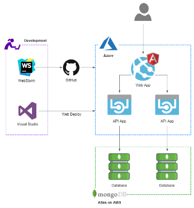

# Angular 4 Restaurant App Demo

Angular 4 web application, developed for the following post, [Developing Applications for the Cloud with Azure App Services and MongoDB Atlas](https://wp.me/p1RD28-5ij). Application is designed to be deployed as Azure Web App, backed by the [Restaurant API](https://github.com/garystafford/RestaurantWebAPI).

https://github.com/garystafford/RestaurantWebAPI

## Project generator

This project was generated with [Angular CLI](https://github.com/angular/angular-cli) version 1.4.9.

## Development server

Run `ng serve` for a dev server. Navigate to `http://localhost:4200/`. The app will automatically reload if you change any of the source files.

## Code scaffolding

Run `ng generate component component-name` to generate a new component. You can also use `ng generate directive|pipe|service|class|guard|interface|enum|module`.

## Build

Run `ng build` to build the project. The build artifacts will be stored in the `dist/` directory. Use the `-prod` flag for a production build.

## Running unit tests

Run `ng test` to execute the unit tests via [Karma](https://karma-runner.github.io).

## Running end-to-end tests

Run `ng e2e` to execute the end-to-end tests via [Protractor](http://www.protractortest.org/).

## Further help

To get more help on the Angular CLI use `ng help` or go check out the [Angular CLI README](https://github.com/angular/angular-cli/blob/master/README.md).

## Project Setup and Run Notes

1. Download and install Node.js and npm

2. Install the Angular CLI globally<br>
  `npm install -g @angular/cli`

  3. Install `ng-bootstrap` dependency into the project<br>
  `npm install --save bootstrap@4.0.0-beta.2`

4. Install `ng-bootstrap` into the project<br>
  `npm install --save @ng-bootstrap/ng-bootstrap`

5. Update dependencies (_optional_)

```bash
npm install david -g
david update
npm install typescript@'>=2.1.0 <2.4.0' --save-dev
```

6. Transpile and run continuously

```bash
ng serve --open # local
ng serve --open --env=prod # Azure/Atlas
```

7. Build for Development

```bash
ng build --env=prod # local
ng build --env=prod # Azure/Atlas
```

8. Build for Production<br>
  `ng build --prod --env=prod`

## References

- <https://angular.io/guide/http#httpclient>>
- <https://ng-bootstrap.github.io/#/getting-started>
- <https://coursetro.com/posts/code/64/How-to-Deploy-an-Angular-App-(Angular-4>)
- <https://www.intertech.com/Blog/deploying-angular-4-apps-with-environment-specific-info>
- <https://medium.com/beautiful-angular/angular-2-and-environment-variables-59c57ba643be>
